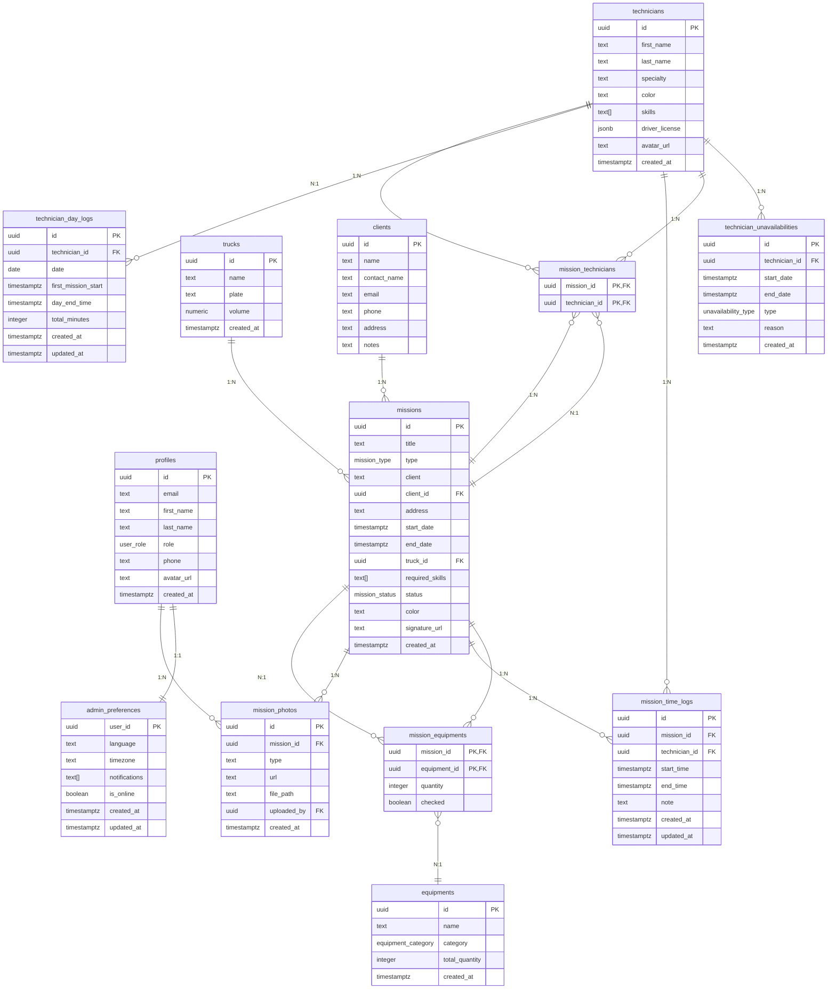

# Schéma de base de données — NeuroEvent

> Basé sur `supabase_schema.sql` + migrations dans `supabase/migrations/`.
> ⚠️ À compléter : les colonnes `client_id` (FK), `phone` (profiles) et `admin_preferences` nécessitent une vérification de migration complète côté Supabase (non vérifié en local).

---

## Conventions

- Clés primaires : `UUID` avec `DEFAULT gen_random_uuid()`.
- Horodatages : `TIMESTAMP WITH TIME ZONE DEFAULT timezone('utc'::text, now()) NOT NULL`.
- Enumérations : types PostgreSQL nommés `*_type` ou `*_status` en suffixe.
- Clés étrangères : `ON DELETE CASCADE` par défaut pour les tables enfant.

---

## Tables

---

### `profiles`

**Description fonctionnelle** : extension de `auth.users`. Associe un rôle et un profil public à chaque utilisateur authentifié.

| Colonne | Type | Contraintes | Description |
|---------|------|-------------|-------------|
| `id` | `UUID` | `PRIMARY KEY`, `REFERENCES auth.users(id) ON DELETE CASCADE` | ID = ID Supabase Auth |
| `first_name` | `TEXT` | `NOT NULL` | Prénom |
| `last_name` | `TEXT` | `NOT NULL` | Nom |
| `email` | `TEXT` | — | Email (copié depuis Auth) |
| `role` | `user_role` | `NOT NULL DEFAULT 'Technicien'` | `Admin` ou `Technicien` |
| `phone` | `TEXT` | Nullable | Numéro de téléphone |
| `avatar_url` | `TEXT` | Nullable | URL publique (Storage bucket `avatars`) |
| `created_at` | `TIMESTAMPTZ` | `NOT NULL DEFAULT now()` | Date de création |

**Enum** `user_role` : `'Admin'`, `'Technicien'`

**Relations** :
- `1:1` avec `auth.users` (via `id`)
- `1:N` avec `mission_time_logs` (`uploaded_by`)

**Index notables** : clé primaire uniquement.

**Politiques RLS** :
- `SELECT` : `true` (public)
- `INSERT` : `true`
- `UPDATE` : `true` (le rôle est protégé par trigger anti-auto-promotion)
- `DELETE` : `true`

> ⚠️ À compléter : vérifier que le trigger `profiles_protect_role` (migration `audit_security`) empêche bien l'auto-promotion.

---

### `admin_preferences`

**Description fonctionnelle** : préférences par utilisateur administrateur (langue, timezone, notifications push, présence en ligne).

| Colonne | Type | Contraintes | Description |
|---------|------|-------------|-------------|
| `user_id` | `UUID` | `PRIMARY KEY` | FK vers `profiles.id` |
| `language` | `TEXT` | `NOT NULL DEFAULT 'fr'` | Code langue (ex: `fr`) |
| `timezone` | `TEXT` | `NOT NULL DEFAULT 'Europe/Paris'` | Timezone IANA |
| `notifications` | `TEXT[]` | `DEFAULT '{}'` | Canaux de notification actifs |
| `is_online` | `BOOLEAN` | `DEFAULT false` | Indicateur de présence |
| `created_at` | `TIMESTAMPTZ` | `NOT NULL DEFAULT now()` | |
| `updated_at` | `TIMESTAMPTZ` | `NOT NULL DEFAULT now()` | |

**Relations** : `1:1` avec `profiles` (user_id PK).

---

### `technicians`

**Description fonctionnelle** : fiche détaillée du technicien (indépendante de l'authentification — permet d'avoir des techniciens sans compte user).

| Colonne | Type | Contraintes | Description |
|---------|------|-------------|-------------|
| `id` | `UUID` | `PRIMARY KEY` | |
| `first_name` | `TEXT` | `NOT NULL` | Prénom |
| `last_name` | `TEXT` | `NOT NULL` | Nom |
| `specialty` | `TEXT` | `NOT NULL` | Spécialité (ex: `Sonorisation`) |
| `color` | `TEXT` | `NOT NULL DEFAULT '#3b82f6'` | Couleur hexadécimale pour l'affichage |
| `skills` | `TEXT[]` | `DEFAULT '{}'` | Tableau de compétences (IDs du catalogue) |
| `driver_license` | `JSONB` | Nullable | `{ hasLicense, since?, categories[] }` |
| `avatar_url` | `TEXT` | Nullable | URL publique (Storage bucket `avatars`) |
| `created_at` | `TIMESTAMPTZ` | `NOT NULL DEFAULT now()` | |

**Relations** :
- `1:N` avec `mission_technicians`
- `1:N` avec `technician_unavailabilities`
- `1:N` avec `mission_time_logs` (technician_id)
- `1:N` avec `technician_day_logs`

**Index notables** : clé primaire uniquement.

**Politiques RLS** : toutes permissives (`true`).

---

### `technician_unavailabilities`

**Description fonctionnelle** : périodes d'indisponibilité (congés, maladie, formation).

| Colonne | Type | Contraintes | Description |
|---------|------|-------------|-------------|
| `id` | `UUID` | `PRIMARY KEY` | |
| `technician_id` | `UUID` | `REFERENCES technicians(id) ON DELETE CASCADE` | |
| `start_date` | `TIMESTAMPTZ` | `NOT NULL` | Début de l'indisponibilité |
| `end_date` | `TIMESTAMPTZ` | `NOT NULL` | Fin de l'indisponibilité |
| `type` | `unavailability_type` | `NOT NULL DEFAULT 'Congé'` | `Congé` ou `Indisponibilité` |
| `reason` | `TEXT` | Nullable | Motif libre |
| `created_at` | `TIMESTAMPTZ` | `NOT NULL DEFAULT now()` | |

**Enum** `unavailability_type` : `'Congé'`, `'Indisponibilité'`

**Relations** : `N:1` avec `technicians`.

**Index notables** :
- `idx_technician_unavailabilities_technician` (technician_id)

**Politiques RLS** : toutes permissives (`true`).

---

### `trucks`

**Description fonctionnelle** : véhicules de l'entreprise用来运输设备和人员。

| Colonne | Type | Contraintes | Description |
|---------|------|-------------|-------------|
| `id` | `UUID` | `PRIMARY KEY` | |
| `name` | `TEXT` | `NOT NULL` | Nom d'usage (ex: `Iveco 1`) |
| `plate` | `TEXT` | `NOT NULL` | Immatriculation |
| `volume` | `NUMERIC` | `NOT NULL` | Volume de chargement (m³) |
| `created_at` | `TIMESTAMPTZ` | `NOT NULL DEFAULT now()` | |

**Relations** :
- `1:N` avec `missions` (truck_id, ON DELETE SET NULL)

**Politiques RLS** : toutes permissives (`true`).

---

### `equipments`

**Description fonctionnelle** : catalogue du matériel technique.

| Colonne | Type | Contraintes | Description |
|---------|------|-------------|-------------|
| `id` | `UUID` | `PRIMARY KEY` | |
| `name` | `TEXT` | `NOT NULL` | Dénomination |
| `category` | `equipment_category` | `NOT NULL` | Catégorie (enum) |
| `total_quantity` | `INTEGER` | `NOT NULL DEFAULT 0` | Quantité totale en stock |
| `created_at` | `TIMESTAMPTZ` | `NOT NULL DEFAULT now()` | |

**Enum** `equipment_category` : `'Arcade'`, `'Sonorisation'`, `'Éclairage'`, `'Scène'`, `'Décoration'`, `'Autre'`

**Relations** :
- `1:N` avec `mission_equipments`

**Politiques RLS** : toutes permissives (`true`).

---

### `clients`

**Description fonctionnelle** : fiches clients pour la saisie rapide et le suivi.

| Colonne | Type | Contraintes | Description |
|---------|------|-------------|-------------|
| `id` | `UUID` | `PRIMARY KEY` | |
| `name` | `TEXT` | `NOT NULL` | Raison sociale |
| `contact_name` | `TEXT` | Nullable | Nom du contact principal |
| `email` | `TEXT` | Nullable | Email contact |
| `phone` | `TEXT` | Nullable | Téléphone |
| `address` | `TEXT` | Nullable | Adresse de facturation / chantier |
| `notes` | `TEXT` | Nullable | Notes internes |

**Relations** :
- `1:N` avec `missions` (client_id, ON DELETE SET NULL)

**Politiques RLS** : toutes permissives (`true`).

---

### `missions`

**Description fonctionnelle** : intervention planifiée sur site.

| Colonne | Type | Contraintes | Description |
|---------|------|-------------|-------------|
| `id` | `UUID` | `PRIMARY KEY` | |
| `title` | `TEXT` | `NOT NULL` | Titre de la mission |
| `type` | `mission_type` | `NOT NULL` | Type d'intervention |
| `client` | `TEXT` | `NOT NULL` | Nom client (saisie libre) |
| `client_id` | `UUID` | `REFERENCES clients(id) ON DELETE SET NULL` | FK optionnelle |
| `address` | `TEXT` | `NOT NULL` | Adresse du chantier |
| `start_date` | `TIMESTAMPTZ` | `NOT NULL` | Début |
| `end_date` | `TIMESTAMPTZ` | `NOT NULL` | Fin |
| `truck_id` | `UUID` | `REFERENCES trucks(id) ON DELETE SET NULL` | Camion assigné |
| `required_skills` | `TEXT[]` | Nullable | Compétences requises + métadonnées préfixées `meta:` |
| `status` | `mission_status` | `NOT NULL DEFAULT 'Planifiée'` | Statut courant |
| `color` | `TEXT` | `NOT NULL DEFAULT '#3b82f6'` | Couleur pour le calendrier |
| `signature_url` | `TEXT` | Nullable | URL Storage de la signature client |
| `created_at` | `TIMESTAMPTZ` | `NOT NULL DEFAULT now()` | |

**Enums** :
- `mission_type` : `'Livraison'`, `'Montage'`, `'Démontage'`, `'Événement complet'`
- `mission_status` : `'Planifiée'`, `'En cours'`, `'Terminée'`

**Note sur `required_skills`** : tableau contenant les compétences requises (ex: `['montage_scene', 'sono']`) PLUS des métadonnées sérialisées avec préfixe `meta:` :
- `meta:delivery:2026-07-01T08:00:00Z` → date de livraison
- `meta:pickup:2026-07-02T18:00:00Z` → date de reprise
- `meta:setup:120` → durée de montage (minutes)
- `meta:report:...` → rapport de mission encodé URL
- `meta:photo:before:url` / `meta:photo:after:url` → URLs photos (legacy)

**Relations** :
- `N:1` avec `clients` (client_id)
- `N:1` avec `trucks` (truck_id)
- `N:N` avec `technicians` (via `mission_technicians`)
- `N:N` avec `equipments` (via `mission_equipments`)
- `1:N` avec `mission_time_logs`
- `1:N` avec `mission_photos`

**Politiques RLS** : toutes permissives (`true`).

---

### `mission_technicians` (table de jointure)

**Description fonctionnelle** : affectation d'un technicien à une mission.

| Colonne | Type | Contraintes | Description |
|---------|------|-------------|-------------|
| `mission_id` | `UUID` | `PRIMARY KEY`, `REFERENCES missions(id) ON DELETE CASCADE` | |
| `technician_id` | `UUID` | `PRIMARY KEY`, `REFERENCES technicians(id) ON DELETE CASCADE` | |

**Cardinalité** : `N:N` entre `missions` et `technicians`.

**Politiques RLS** : toutes permissives (`true`).

---

### `mission_equipments` (table de jointure)

**Description fonctionnelle** : matériel affecté à une mission, avec quantité et pointage.

| Colonne | Type | Contraintes | Description |
|---------|------|-------------|-------------|
| `mission_id` | `UUID` | `PRIMARY KEY (mission_id, equipment_id)`, `REFERENCES missions(id) ON DELETE CASCADE` | |
| `equipment_id` | `UUID` | `PRIMARY KEY (mission_id, equipment_id)`, `REFERENCES equipments(id) ON DELETE CASCADE` | |
| `quantity` | `INTEGER` | `NOT NULL DEFAULT 1` | Quantité affectée |
| `checked` | `BOOLEAN` | Nullable | Pointage technicien (true = coché) |

**Cardinalité** : `N:N` entre `missions` et `equipments`.

**Index notables** : PK composite sur `(mission_id, equipment_id)`.

**Politiques RLS** : toutes permissives (`true`).

---

### `mission_time_logs`

**Description fonctionnelle** : enregistrement des tranches horaires de travail sur une mission.

| Colonne | Type | Contraintes | Description |
|---------|------|-------------|-------------|
| `id` | `UUID` | `PRIMARY KEY` | |
| `mission_id` | `UUID` | `REFERENCES missions(id) ON DELETE CASCADE` | |
| `technician_id` | `UUID` | `REFERENCES technicians(id) ON DELETE CASCADE` | |
| `start_time` | `TIMESTAMPTZ` | `NOT NULL` | Début de la tranche |
| `end_time` | `TIMESTAMPTZ` | Nullable | Fin (null = en cours) |
| `note` | `TEXT` | Nullable | Commentaire libre |
| `created_at` | `TIMESTAMPTZ` | `NOT NULL DEFAULT now()` | |
| `updated_at` | `TIMESTAMPTZ` | `NOT NULL DEFAULT now()` | |

**Relations** :
- `N:1` avec `missions`
- `N:1` avec `technicians`

**Index notables** :
- `idx_mission_time_logs_mission` (mission_id)
- `idx_mission_time_logs_technician` (technician_id)

**Politiques RLS** : toutes permissives (`true`).

---

### `mission_photos`

**Description fonctionnelle** : photos de terrain (avant / après intervention) stockées dans Supabase Storage.

| Colonne | Type | Contraintes | Description |
|---------|------|-------------|-------------|
| `id` | `UUID` | `PRIMARY KEY` | |
| `mission_id` | `UUID` | `REFERENCES missions(id) ON DELETE CASCADE`, `NOT NULL` | |
| `type` | `TEXT` | `NOT NULL`, `CHECK (type IN ('before', 'after'))` | Type de photo |
| `url` | `TEXT` | `NOT NULL` | URL publique Supabase Storage |
| `file_path` | `TEXT` | `NOT NULL` | Chemin dans le bucket (`missionId/type/timestamp.jpg`) |
| `uploaded_by` | `UUID` | `REFERENCES profiles(id) ON DELETE SET NULL` | Utilisateur qui a uploadé |
| `created_at` | `TIMESTAMPTZ` | `NOT NULL DEFAULT now()` | |

**Relations** :
- `N:1` avec `missions`
- `N:1` avec `profiles` (uploaded_by, nullable)

**Index notables** :
- `idx_mission_photos_mission` (mission_id)

**Politiques RLS** : toutes permissives (`true`).

**Storage** :
- Bucket `mission-photos` (public en lecture, authentifié en écriture).
- Chemin : `missionId/type/timestamp.jpg`.
- Compression : JPEG 0.82, max 1920 px (côté client).

---

### `technician_day_logs`

**Description fonctionnelle** : résumé journalier du temps de travail par technicien.

| Colonne | Type | Contraintes | Description |
|---------|------|-------------|-------------|
| `id` | `UUID` | `PRIMARY KEY` | |
| `technician_id` | `UUID` | `REFERENCES technicians(id) ON DELETE CASCADE` | |
| `date` | `DATE` | `NOT NULL` | Jour (`YYYY-MM-DD`) |
| `first_mission_start` | `TIMESTAMPTZ` | `NOT NULL` | Heure de début de la première mission |
| `day_end_time` | `TIMESTAMPTZ` | `NOT NULL` | Heure de fin de journée |
| `total_minutes` | `INTEGER` | `NOT NULL` | Durée totale en minutes (calculée côté client) |
| `created_at` | `TIMESTAMPTZ` | `NOT NULL DEFAULT now()` | |
| `updated_at` | `TIMESTAMPTZ` | `NOT NULL DEFAULT now()` | |

**Relations** : `N:1` avec `technicians`.

**Index notables** :
- `idx_technician_day_logs_technician` (technician_id)
- `idx_technician_day_logs_date` (date)

**Politiques RLS** : toutes permissives (`true`).

---

## Stockage objet (Storage buckets)

| Bucket | Visibilité | Usage |
|--------|-----------|-------|
| `signatures` | Public (lecture), Authentifié (écriture) | Stockage des signatures clients (mission) |
| `mission-photos` | Public (lecture), Authentifié (écriture) | Photos avant/après mission, compression client |
| `avatars` | Public (lecture), Authentifié (écriture) | Avatars techniciens et profiles |

> ⚠️ À compléter : vérifier le bucket `avatars` dans les migrations (référencé dans `src/types/index.ts` pour `Profile.avatarUrl` et `Technician.avatarUrl`).

---

## Diagramme ERD (Mermaid)

---

## Notes de migration

| Migration | Ajout | Note |
|-----------|-------|------|
| `20260610000000` | Trigger audit, sécurité RLS, Storage `signatures` | |
| `20260611115500` | `skills` (technicians), `driver_license` (JSONB) | |
| `20260611122200` | `mission_time_logs` | |
| `20260611130000` | `mission_photos` (table + Storage `mission-photos`) | |
| `20260616130000` | `phone` (profiles), `admin_preferences`, `notifications` (profiles) | ⚠️ Vérifier existence |
| `20260616140000` | Bucket `avatars` | |
| `20260616150000` | `avatar_url` sur `technicians` | |
| `20260617_technician_day_logs` | `technician_day_logs` | |